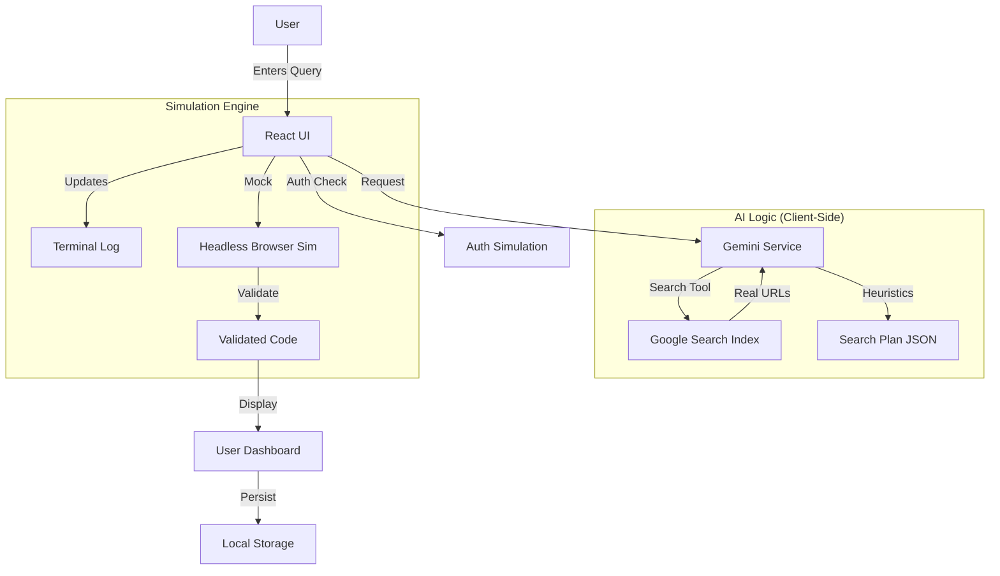

# 🎯 CodeSniper - AI Discount Intelligence Platform

> **The First AI-Powered Autonomous Agent that scours the live web, finds, tests, and validates discount codes in real-time.**

---

## 📖 About This Project
CodeSniper is a Next-Gen coupon finder application. Unlike traditional static sites, it uses **Generative AI (Google Gemini 2.5 Flash)** equipped with **Search Grounding** to perform live investigations on the web.

This repository contains the **Frontend-First MVP**. It simulates complex backend logic (headless browsing, user persistence) within the browser to demonstrate the full UX flow before heavy backend infrastructure is deployed.

---

## 🏗️ System Architecture (Current)

This diagram describes how the application currently functions. Code Wiki will render this as an interactive chart.

---

## ✨ Key Features
*   **🧠 AI-Driven Search**: Uses LLMs to "plan" a search strategy based on the store name and user region.
*   **🌍 Multi-Region Support**: Filters results for US, UK, UAE, JP, etc.
*   **⚡ Real-Time Grounding**: Connects to the live Google Search index to find codes posted in the last 24 hours.
*   **🛡️ Verification Simulation**: Mimics the process of a headless browser testing codes in a cart.
*   **🌗 Dark/Light Mode**: Fully themable UI with persistence.
*   **🏆 Gamified Dashboard**: Referral systems, search limits, and "Pro" tier upgrades.

---

## 📂 Repository Structure

*   **`src/App.tsx`**: The Central Brain. Handles routing, state (User, History, Inbox), and the main render loop.
*   **`src/services/geminiService.ts`**: The AI Interface. Handles the prompt engineering and connection to Google's API.
*   **`src/components/`**: Reusable UI blocks.
    *   `TerminalLog.tsx`: The Matrix-style scrolling log.
    *   `Dashboard.tsx`: The massive user management modal.
    *   `AuthModal.tsx`: Login/Signup logic.
*   **`src/types.ts`**: TypeScript definitions for Data Models.

---

## 🚀 Next Steps (The Backend Migration)
Currently, this app uses `localStorage` and `setTimeout` to mimic a database. The goal is to move this to **Firebase**.

See **[BACKEND_ROADMAP.md](./BACKEND_ROADMAP.md)** for the interactive checklist.
